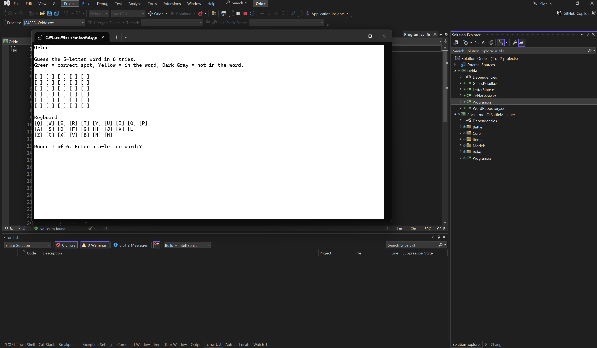
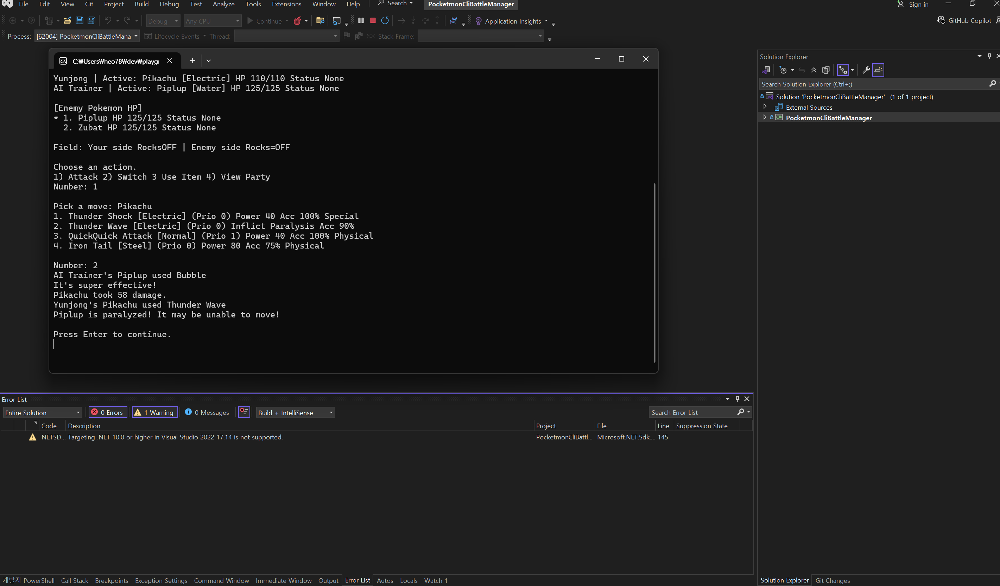
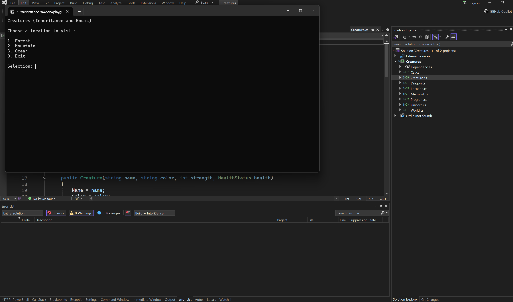
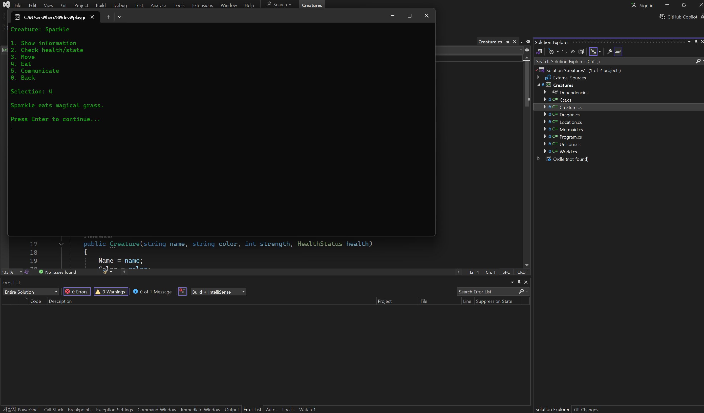

# Yunjong Heo Programming Portfolio

## Crafting System
Description:
A C# crafting and inventory management application demonstrating object-oriented programming concepts.

### Screenshots

### Technical Details
- Inventory system
- Crafting logic
- C# OOP structure

---

## Creatures
Description:
Application demonstrating inheritance, enums, and overridden methods.

---

## Ordle
Description:
Wordle-inspired word guessing game built in C#.

---

## Pokemon CLI Battle Manager
Description:
Turn-based Pokémon-inspired battle system with inventory, status effects, enums, interfaces, and battle logic.
